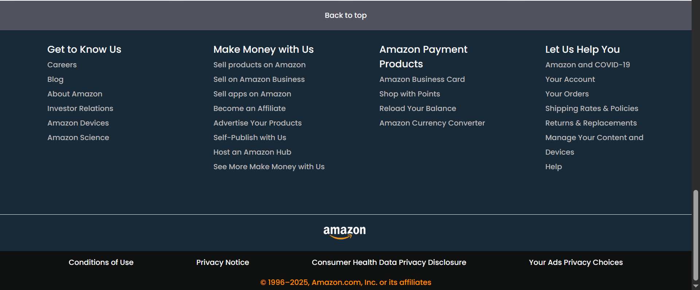

# Amazon Homepage Clone (HTML & CSS)

This is a static front-end clone of Amazon's homepage built using only HTML and CSS. The goal of this project was to replicate the core layout and visual elements of the Amazon UI to strengthen fundamental web development skills.

## Features

- Structured navigation bar with logo, location selector, and search functionality (non-functional).
- Product category grid with styled cards and background images.
- Responsive-looking layout sections (note: not responsive for smaller screens).
- Footer with common links, legal information, and styling similar to the original site.

## Technologies Used

- HTML5
- CSS3
- Google Fonts (Poppins, Roboto)
- Font Awesome (for icon styling)

## How to Run

1. Clone or download this repository.
2. Open `index.html` in any web browser.
3. All styling is local via `styles.css`, so no server is required.

## Screenshots

<table>
  <tr>
    <td></td>
    <td></td>
  </tr>
  <tr>
    <td></td>
    <td></td>
  </tr>
</table>

## Limitations

- This project is static and non-responsive.
- No backend, interactivity, or JavaScript functionality is included.

## Future Improvements

- Add responsiveness using Flexbox/Grid and media queries.
- Integrate JavaScript for interactive features (search, cart, dropdowns).
- Enhance layout accessibility and ARIA labels.

## Author

Srinithi Babu  
Third-Year Computer Science Engineering Student  
Contact via [GitHub](https://github.com/Srinithi5106) 

## License

This project is created for educational purposes and is not affiliated with Amazon. All logos and content belong to their respective owners.

